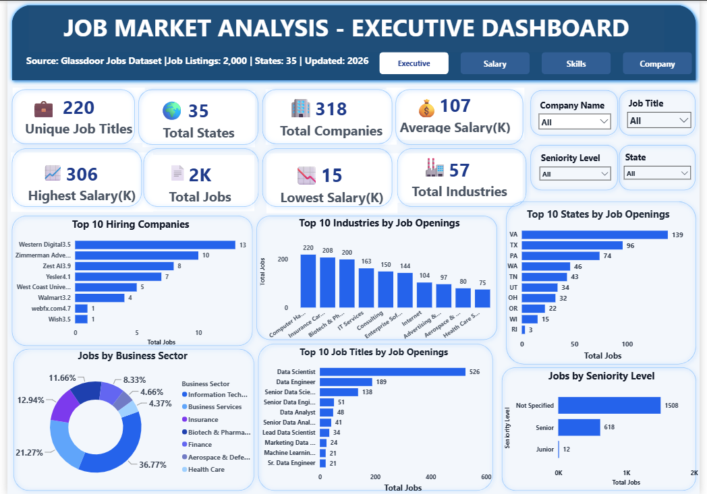
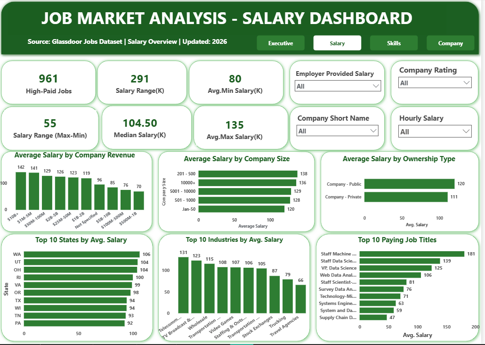
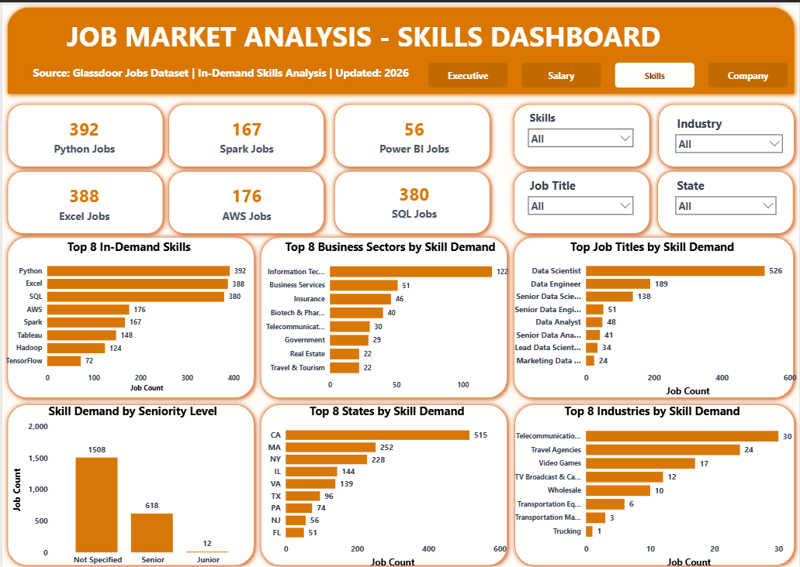
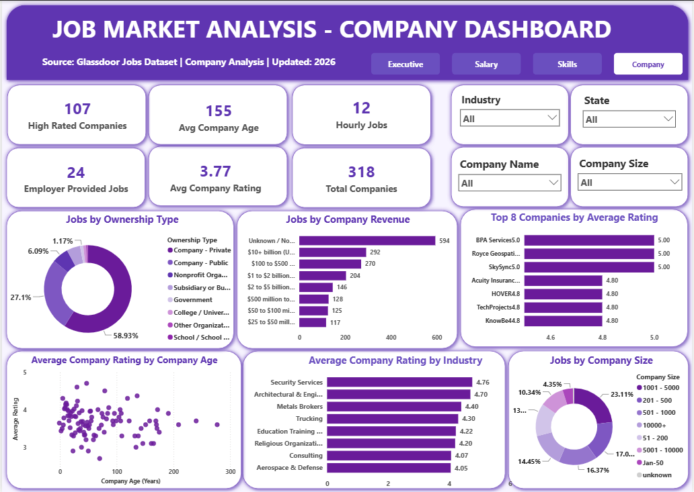

# 📊 Job Market Analysis

An End-to-End **SQL & Power BI** project analyzing the U.S. Data & Analytics Job Market using the Glassdoor Jobs Dataset. This project demonstrates data cleaning, SQL analysis, Power BI dashboard development, and business intelligence reporting to uncover hiring trends, salary patterns, skill demand, and company insights.

---

## Project Overview

This project analyzes real-world Glassdoor job postings to understand the current U.S. data and analytics job market. The dataset was cleaned and validated using MySQL, followed by interactive dashboard development in Power BI.

The project transforms raw job data into meaningful business insights that can help job seekers, employers, recruiters, and workforce planners make informed decisions. The overall workflow covers SQL data preparation, business analysis, visualization, and reporting.

---

## Project Objectives

- Clean and validate raw job market data
- Perform SQL-based business analysis
- Analyze salary trends across states and industries
- Identify the most in-demand technical skills
- Evaluate hiring companies and company ratings
- Build interactive Power BI dashboards
- Generate business recommendations from analytical findings

---

## Project Workflow

```text
Glassdoor Dataset
        │
        ▼
Data Cleaning (MySQL)
        │
        ▼
SQL Business Analysis
        │
        ▼
Power Query Transformation
        │
        ▼
DAX Measures
        │
        ▼
Power BI Dashboards
        │
        ▼
Business Insights & Recommendations
```

## Tools & Technologies

- MySQL Workbench
- SQL
- Power BI Desktop
- Power Query
- DAX
- Microsoft Excel
- Glassdoor Jobs Dataset

---

## Dataset Information

| Item | Details |
|------|---------|
| Dataset | Glassdoor Jobs Dataset |
| Total Job Listings | 2,000 |
| Companies | 318 |
| States | 35 |
| Industries | 57 |
| Average Salary | $107K |

---

# 📊 Dashboard Preview

## Executive Dashboard
Provides a high-level overview of the job market, including KPIs, top hiring companies, industries, job titles, business sectors, and state-wise job openings.

[](https://1drv.ms/i/c/54cbeda012444387/IQAzuf1G5BRzSp69Lxs4eDusATczOvPyDNf2dGk_jNBrg4Y?e=PIndoe)

---

## Salary Dashboard
Analyzes salary trends by state, industry, company size, ownership type, revenue category, and highest-paying job titles.

[](https://1drv.ms/i/c/54cbeda012444387/IQDvlw32k5xCRZvGXDJeyVxGAXh-unZOLlY-kw4N50kXDso?e=djfMaH)

---

## Skills Dashboard
Highlights the most in-demand technical skills, skill demand across industries, states, seniority levels, and job titles.

[](https://1drv.ms/i/c/54cbeda012444387/IQC09AbSyQxZR4YikQd5789kATD6YLFo0hBURlSvW5ytsLQ?e=7zxc2e)

---

## Company Dashboard
Explores company ratings, ownership type, revenue, company size, age, and top-rated organizations.

[](https://1drv.ms/i/c/54cbeda012444387/IQA_bnIkWnp2QrI_KcUD8DqcAR3zH8uOH-1XkfGBSKpelEk?e=RXD4o8)

# Dashboard Highlights

### Executive Dashboard

- Job Market Overview
- Hiring Companies
- Industry Analysis
- Business Sector Analysis
- State-wise Job Openings
- Seniority Distribution
- Job Titles Analysis

---

### Salary Dashboard

- Salary Distribution
- Highest Paying States
- Highest Paying Industries
- Company Size Salary Analysis
- Revenue vs Salary
- Ownership Type Salary
- Top Paying Job Titles

---

### Skills Dashboard

- Top In-Demand Skills
- Skill Demand by Industry
- Skill Demand by State
- Skill Demand by Job Title
- Skill Demand by Seniority

---

### Company Dashboard

- Company Ratings
- Ownership Analysis
- Revenue Analysis
- Company Size Distribution
- Industry Rating
- Company Age Analysis

---

# SQL Analysis

The SQL analysis includes:

- Database Creation
- Data Cleaning
- Duplicate Validation
- NULL Value Analysis
- Data Transformation
- Salary Analysis
- State-wise Job Analysis
- Industry Analysis
- Company Analysis
- Skills Analysis
- Business Insights

---


## SQL Concepts Used

- SELECT
- WHERE
- GROUP BY
- ORDER BY
- HAVING
- Aggregate Functions
- CASE Statements
- String Functions
- UPDATE
- NULL Handling
- Data Cleaning

  ---

  ## Power BI Features

- Interactive Dashboards
- KPI Cards
- Power Query
- DAX Measures
- Dynamic Slicers
- Cross Filtering
- Data Modeling
- Drill-through Analysis

  ---
  
  ## DAX Measures

- Total Jobs
- Average Salary
- Highest Salary
- Lowest Salary
- Median Salary
- Total Companies
- Company Rating
- Skill Counts

  ---
  
# Key Business Insights

- Data Scientist is the most in-demand role.
- Virginia records the highest number of job openings.
- Telecommunications offers the highest average salaries.
- Python, SQL, and Excel are the most requested skills.
- Public companies generally offer higher salaries than private companies.
- Mid-sized companies provide competitive salary packages.
- California leads overall technical skill demand.

---

# Business Recommendations

### For Job Seekers

- Focus on Python, SQL, and Excel.
- Target high-demand states.
- Improve cloud and big-data skills.

### For Employers

- Improve salary competitiveness.
- Clearly define seniority levels.
- Increase transparency in job postings.

### For Workforce Planners

- Invest in cloud computing training.
- Promote structured entry-level hiring.

---

# Project Files

- README.md
- Job_Market_Analysis.pbix
- Job_Market_Analysis.csv
- Job_Market_Analysis_SQL_Queries.sql
- Job_Market_Analysis_Report.pdf
- Job_Market_Analysis_Presentation.pptx
- Executive_Dashboard.png
- Salary_Dashboard.png
- Skills_Dashboard.png
- Company_Dashboard.png

---

# Skills Demonstrated

- SQL
- MySQL
- Data Cleaning
- Data Validation
- Data Analysis
- Business Analysis
- Power BI
- Power Query
- DAX
- Dashboard Design
- Data Visualization
- Data Storytelling

---

# Future Enhancements

- Predictive Salary Modeling
- Machine Learning Integration
- Live Data Refresh
- Interactive Maps
- Trend Forecasting
- Additional Job Portal Integration

---

# Author

**Baliji Mohan**

Data Analyst | SQL | Power BI | Python | Excel

GitHub: https://github.com/balijimohan

LinkedIn: https://www.linkedin.com/in/mohan-baliji-083b90254/

---

## If you found this project useful, consider giving it a ⭐ on GitHub.
